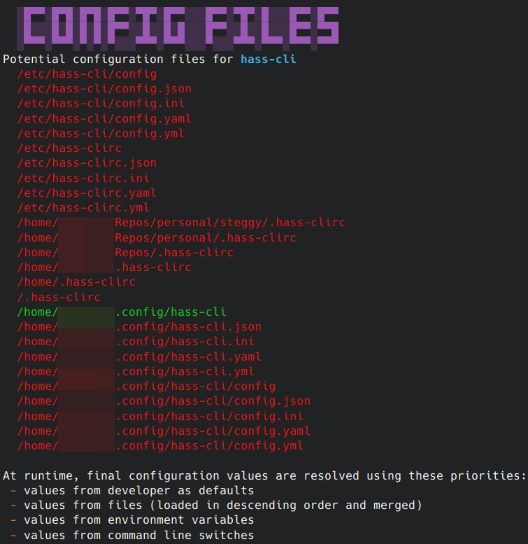

<<<<<<< HEAD
# 🦕 [@digital-alchemy](https://github.com/zoe-codez/digital-alchemy) monorepo

`@digital-alchemy` is a collections of libraries built on top of the [NestJS](https://nestjs.com/) framework.
It features a quick bootstrapping interface, powerful configuration and helper services, flexible terminal utilities, and more!
=======

<h1 align="center">💻 Digital Alchemy Monorepo 🔮</h1>
>>>>>>> cbfe62d9ca2f073674068267d1d093e2149d7378

## Description

`@digital-alchemy` is a collections of projects built on top of the [NestJS](https://nestjs.com/) framework.
The repository is a collection of general purpose libraries for building premium terminal applications, microservices, home automation logic, and more.

<<<<<<< HEAD
> `@digital-alchemy` targets node 16+

```bash
# Check out code
git clone git@github.com:zoe-codez/digital-alchemy.git
cd ./digital-alchemy
# Install node modules
yarn
```
=======
### Editor Features

Editor interactions are a strong focus for consuming this project.
All projects are built with Typescript from the ground up.
Some projects feature [Proxy](https://developer.mozilla.org/en-US/docs/Web/JavaScript/Reference/Global_Objects/Proxy) APIs that build custom types based on their capabilities.
>>>>>>> cbfe62d9ca2f073674068267d1d093e2149d7378

## Public Packages

### Applications

| package | install | notes |
| --- | --- | --- |
| [@digital-alchemy/config-builder](apps/config-builder)  | [npm](https://www.npmjs.com/package/@digital-alchemy/config-builder) | Terminal app for managing config files related to a `@digital-alchemy` app |
| [@digital-alchemy/hass-type-generate](apps/hass-type-generate) | [npm](https://www.npmjs.com/package/@digital-alchemy/hass-type-generate) | Companion app for `@digital-alchemy/home-assistant` |
| [@digital-alchemy/log-formatter](apps/log-formatter)  | [npm](https://www.npmjs.com/package/@digital-alchemy/log-formatter) | `\|` pipe friendly tool to reformat json logs to pretty logs |

<<<<<<< HEAD
A script to manage file based configurations for applications based off `@digital-alchemy/boilerplate`.
It can act as a "settings screen" for applications, outputting either environment variables, or to more persistent configuration files.
=======
### Libraries
>>>>>>> cbfe62d9ca2f073674068267d1d093e2149d7378

| package | install | notes |
| --- | --- | --- |
| [@digital-alchemy/automation-logic](libs/automation-logic) | [npm](https://www.npmjs.com/package/@digital-alchemy/automation-logic) | Extended tools for building home automation services |
| [@digital-alchemy/boilerplate](libs/boilerplate) | [npm](https://www.npmjs.com/package/@digital-alchemy/boilerplate) | Bootstrapping, configuration, logging, and other basics |
| [@digital-alchemy/home-assistant](libs/home-assistant) | [npm](https://www.npmjs.com/package/@digital-alchemy/home-assistant) | Websocket and rest api bindings for Home Assistant. Features dyn |
| [@digital-alchemy/mqtt](libs/mqtt) | [npm](https://www.npmjs.com/package/@digital-alchemy/mqtt) | Basic MQTT bindings |
| [@digital-alchemy/rgb-matrix](libs/rgb-matrix) | [npm](https://www.npmjs.com/package/@digital-alchemy/rgb-matrix) | Layout and rendering utilities for arduino rgb matrix displays |
| [@digital-alchemy/server](libs/server) | [npm](https://www.npmjs.com/package/@digital-alchemy/server) | Http server support & basic utilities |
| [@digital-alchemy/testing](libs/testing) | [npm](https://www.npmjs.com/package/@digital-alchemy/testing) | Testing utilities |
| [@digital-alchemy/tty](libs/tty) | [npm](https://www.npmjs.com/package/@digital-alchemy/tty) | Prompts and rendering utilities for interactions inside of the terminal |
| [@digital-alchemy/utilities](libs/utilities) | [npm](https://www.npmjs.com/package/@digital-alchemy/utilities) | Standard utilities and constants used across the project |

## Example Terminal Apps

Sometimes useful example code.

<<<<<<< HEAD
```bash
# install config builder
yarn add -D @digital-alchemy/config-builder
# output configuration to file
node ./your_script.js --scan-config > ./config.json
# launch script
npx config-builder --definition_file ./config.json
```

| Edit variables | Audit setup |
| --- | --- |
| [](./apps/config-builder/recordings/sampler_app.gif) | [](./apps/config-builder/docs/example2.png) |

### [Sampler App](apps/sampler-app) (active development)
=======
### [Sampler App](apps/sampler-app)
>>>>>>> cbfe62d9ca2f073674068267d1d093e2149d7378

Demo app for TTY library functionality. Get a quick feel for how things look and work from inside your terminal.

```bash
# run dev server
npx nx serve sampler-app
```

### [Hass CLI](apps/hass-cli)

Basic interactions with Home Assistant, in the form of a terminal app.
Exists as both a convenience/development tool, and a place for practical testing of functionality provided by `@steggy/home-assistant`.

```bash
# run dev server with credentials passed in via environment variables
BASE_URL=http://homeassistant.some.domain TOKEN=long_lived_access_token npx nx serve hass-cli
```

<<<<<<< HEAD
Basic interactions with Home Assistant, in the form of a terminal app.
Exists as both a convenience/development tool, and a place for practical testing of functionality provided by `@digital-alchemy/home-assistant`.
=======
## Example Automation
>>>>>>> cbfe62d9ca2f073674068267d1d093e2149d7378

This code is intended to interact with Home Assistant.
A [dockerized reference install](apps/examples/docker/homeassistant) is included with this repository intended for use with these apps to prevent accidental changes to your normal install.

### [Entity Creation](apps/examples/entity-creation)

Minimal example app. Creates a few entities and not much else.

<<<<<<< HEAD
Companion application to `@digital-alchemy/home-assistant`. Intended to rewrite library type definitions to match a specific home assistant install.
Has no function from within this repo, must be installed as a node_module in a separate repo to have an effect.
`@digital-alchemy/home-assistant` will run this script as a post install hook to keep it's own definitions as up to date as possible.
It can also be run manually as needed.

```bash
# install
yarn add -D @digital-alchemy/hass-type-generate
# execute
npx hass-type-generate
```
=======
### [Scene Manager](apps/examples/scene-manager)

> requires external mqtt dependency and additional configuration to be actually functional
>>>>>>> cbfe62d9ca2f073674068267d1d093e2149d7378

An example home automation app, which manages several rooms.

## Versioning notes

> ⚠️ all packages are expected to be installed at the same version.

<<<<<<< HEAD
### [Automation Logic](libs/automation-logic)

A set of tools for more cohesively bringing together `@digital-alchemy/home-assistant` with home automation logic.
Build out rooms with scenes, managed circadian lighting, and more.

### [Boilerplate](libs/boilerplate)

NestJS application bootstrapping functions, configuration, logging, and general purpose tools.

### [Home Assistant](libs/home-assistant)

Tools for interacting with Home Assistant. Contains wrappers for rest api, and websocket api.
Has the ability to transform it's internal type definitions and code api to match a target home assistant install.

### [MQTT](libs/mqtt)

Simple MQTT bindings.

### [RGB Matrix](libs/rgb-matrix)

> Note: experimental code. Requires optimization and may experience API changes

Portable type definitions and utilities related to performing layout and rendering with pixel matrixes.
These libraries are intended to be consumed in both non-rendering environments (ex: server performing layout), and rendering environments (ex: pi receiving layout, and needing to display it).

This library is intended to work with [rpi-led-matrix](https://www.npmjs.com/package/rpi-led-matrix), proving canned animations and tools for doing layout as a grid of panels, instead of just chains.

### [Server](libs/server)

Enables web server functionality for [@digital-alchemy/boilerplate](libs/boilerplate).
Provides generic middleware tools like `cors` and automatic request logging

### [TTY](libs/tty)

Utilities for creating terminal applications.

- Menus
- Prompts
- Keyboard management
- Screen management
- Cursor management

Enables the `--help` switch, which will output available configuations that can be sent via command line switches.

> Note: switches are accepted without TTY, this just adds a reporting mechanism
=======
Version format: year.week.build
>>>>>>> cbfe62d9ca2f073674068267d1d093e2149d7378
