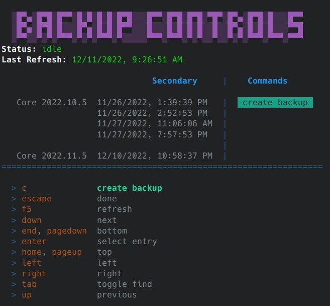

# 🦕 [@digital-alchemy](https://github.com/mp3three/digital-alchemy) monorepo

`@digital-alchemy` is a collections of libraries built on top of the [NestJS](https://nestjs.com/) framework.
It features a quick bootstrapping interface, powerful configuration and helper services, flexible terminal utilities, and more!

The primary focus of this library is non-web applications, such as terminal apps, home automation services, and other standalone microservices.

## Local Setup (try things out!)

> `@digital-alchemy` targets node 16+

```bash
# Check out code
git clone git@github.com:mp3three/digital-alchemy.git
cd ./digital-alchemy
# Install node modules
yarn
```

## Applications

Applications built as functionality demos, and utilities for consumption in other repositories.

### [Config Builder](apps/config-builder)

A script to manage file based configurations for applications based off `@digital-alchemy/boilerplate`.
It can act as a "settings screen" for applications, outputting either environment variables, or to more persistent configuration files.

> In repo example

```bash
# generate example config
npx nx scan-config sampler-app
# run config-builder with config
DEFINITION_FILE=./dist/configs/sampler-app.json npx nx serve config-builder
```

> Standalone example

```bash
# install config builder
yarn add -D @digital-alchemy/config-builder
# output configuration to file
node ./your_script.js --scan-config > ./config.json
# launch script
npx config-builder --definition_file ./config.json
```

| Edit variables | Audit setup |
| --- | --- |
| [](./apps/config-builder/recordings/sampler_app.gif) | [](./apps/config-builder/docs/example2.png) |

### [Sampler App](apps/sampler-app) (active development)

Demo app for TTY library functionality. Get a quick feel for how things look and work from inside your terminal.

```bash
# run dev server
npx nx serve sampler-app
```

| Table based object builder | Complex menu based interfaces |
| --- | --- |
|[](./apps/sampler-app/docs/options.png)|[](./apps/sampler-app/docs/result.png)

### [Hass CLI](apps/hass-cli) (active development)

```bash
# run dev server with credentials passed in via environment variables
BASE_URL=http://homeassistant.some.domain TOKEN=long_lived_access_token npx nx serve hass-cli
```

Basic interactions with Home Assistant, in the form of a terminal app.
Exists as both a convenience/development tool, and a place for practical testing of functionality provided by `@digital-alchemy/home-assistant`.

| Commands | Backup |
| --- | --- |
| [](./apps/hass-cli/docs/example.png) | [](./apps/hass-cli/docs/backup.png) |

### [Hass Type Generate](apps/hass-type-generate)

> Note: requires credentials for home assistant, best practice is to store in `~/.config/hass-type-generate`

Companion application to `@digital-alchemy/home-assistant`. Intended to rewrite library type definitions to match a specific home assistant install.
Has no function from within this repo, must be installed as a node_module in a separate repo to have an effect.
`@digital-alchemy/home-assistant` will run this script as a post install hook to keep it's own definitions as up to date as possible.
It can also be run manually as needed.

```bash
# install
yarn add -D @digital-alchemy/hass-type-generate
# execute
npx hass-type-generate
```

### [Log Formatter](apps/log-formatter)

Pipe JSON logs in via stdin, get pretty/readable logs out.
Fills same idea as [pino-pretty](https://www.npmjs.com/package/pino-pretty), internal formatter instead.

## Libraries

### [Automation Logic](libs/automation-logic)

A set of tools for more cohesively bringing together `@digital-alchemy/home-assistant` with home automation logic.
Build out rooms with scenes, managed circadian lighting, and more.

### [Boilerplate](libs/boilerplate)

NestJS application bootstrapping functions, configuration, logging, and general purpose tools.

### [Home Assistant](libs/home-assistant)

Tools for interacting with Home Assistant. Contains wrappers for rest api, and websocket api.
Has the ability to transform it's internal type definitions and code api to match a target home assistant install.

### [MQTT](libs/mqtt)

Simple MQTT bindings.

### [RGB Matrix](libs/rgb-matrix)

> Note: experimental code. Requires optimization and may experience API changes

Portable type definitions and utilities related to performing layout and rendering with pixel matrixes.
These libraries are intended to be consumed in both non-rendering environments (ex: server performing layout), and rendering environments (ex: pi receiving layout, and needing to display it).

This library is intended to work with [rpi-led-matrix](https://www.npmjs.com/package/rpi-led-matrix), proving canned animations and tools for doing layout as a grid of panels, instead of just chains.

### [Server](libs/server)

Enables web server functionality for [@digital-alchemy/boilerplate](libs/boilerplate).
Provides generic middleware tools like `cors` and automatic request logging

### [TTY](libs/tty)

Utilities for creating terminal applications.

- Menus
- Prompts
- Keyboard management
- Screen management
- Cursor management

Enables the `--help` switch, which will output available configuations that can be sent via command line switches.

> Note: switches are accepted without TTY, this just adds a reporting mechanism
