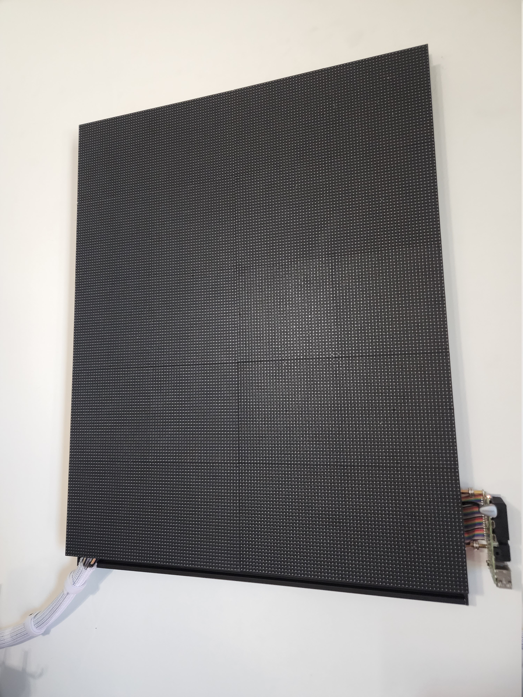
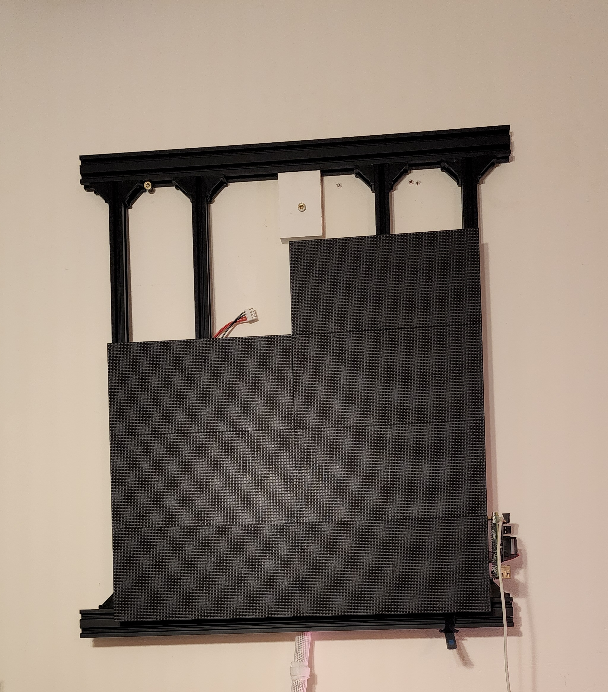
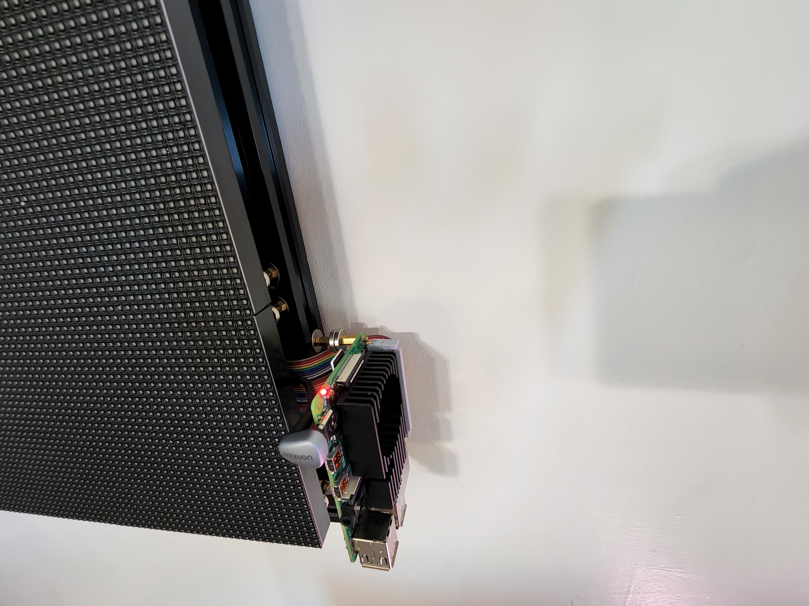

# Description

This project details the construction of Pi Matrix compatible hardware, and provides the software to do the rendering (coming soon)

## Hardware

> Links provided for easy to find product reference, project can be made much more cost efficiently
>
> Items marked as optional if they can be easily worked around with

### Controller

> Version 2 controller

| Front | Side |
| --- | --- |
|  |  |

> Table shows device as built
>
> See see [here](https://github.com/hzeller/rpi-rgb-led-matrix) for hardware compatibility and configuration details

| Name | Purchase Link | Required | Notes |
| --- | --- | --- | --- |
| Raspberry Pi 4 | n/a | Y | I was not able to get a 3B+ stable: [recording](./docs/images/pi_3b.gif) |
| Cooling / case | [Amazon](https://www.amazon.com/dp/B07VD568FB) | N | This one is very solid, and is great for keeping things contained. Version 1 uses a different cooler (see magnetic mounting section) |
| Speaker | [Amazon](https://www.amazon.com/gp/product/B075M7FHM1) | N | Used for audio alerts |
| Ribbon Cable | [Amazon](https://www.amazon.com/dp/B07D991KMR) | N | For orgnization. Can use jumpers to go from device directly to 16 pin cable if desired |

### Matrix

| Name | Purchase Link | Required | Notes |
| --- | --- | --- | --- |
| Power Supply | [Amazon](https://www.amazon.com/dp/B06XK2DDW4) | Y | Any 5V power source should be fine with sufficient amperage. Prototype builds used retired PC power supply |
| Power Cord | n/a | Y | Use one of your extras |
| End Cap | [Amazon](https://www.amazon.com/gp/product/B09JS8L4XT) | N | Aesthetics |
| Dual extruded aluminum | [Amazon](https://www.amazon.com/gp/product/B08X4PB5GC) | Y | Structural |
| Single extruded aluminum | [Amazon](https://www.amazon.com/gp/product/B087PVD55Y) | Y | Structural |
| Corner bracket | [Amazon](https://www.amazon.com/gp/product/B0855V2JV3) | Y | Structural |
| Countersunk Magnets | [Amazon](https://www.amazon.com/gp/product/B0816HQ5RD) | Y | Magnetic mount |
| M3 screw | [Amazon](https://www.amazon.com/gp/product/B018RSXQ02) | Y | Magnetic mount |
| M3 washers | [Amazon](https://www.amazon.com/gp/product/B07WST3YJJ) | Y | Magnetic mount |
| M3 T-nut | [Amazon](https://www.amazon.com/gp/product/B08NZMD2BJ) | Y | Magnetic mount |
| M3 standoff | [Amazon](https://www.amazon.com/gp/product/B00MJU8PM) | Y | Magnetic mount |
| Cable connector | [Amazon](https://www.amazon.com/gp/product/B07WHFWMYQ) | N | Extra cable needed for laying out matrix in grid |
| Extra ribbon cable | [Amazon](https://www.amazon.com/gp/product/B07PBGVCNL) | N | Extra cable needed for laying out matrix in grid |
| Ribbon connectors | [Amazon](https://www.amazon.com/gp/product/B00E57QQVG) | N | Extra cable needed for laying out matrix in grid |
| Slot cover | [Amazon](https://www.amazon.com/gp/product/B09KPZBTB9) | N | Aesthetics |
| RGB matrix | [Adafruit](https://www.adafruit.com/product/2278) | Y | Anything compatible with [library](https://github.com/hzeller/rpi-rgb-led-matrix)
| Matrix bonnet | [Adafruit](https://www.adafruit.com/product/3211) | N | Only purpose currently is to adapt from 40pin to 16pin. In smaller setups, it can be used to power the matrix |

### Odds and ends

- Hot glue (sanity)
- Zip tie (sanity)
- Wire nuts (power)
- Extra wire (power)
- [SD card](https://www.amazon.com/dp/B08KSSX9PH)
- Metallic sharpie (marking aluminum)
- Hacksaw (cutting extruded aluminum)

## Controller Construction

TODO

## Matrix Contruction

The matrix is made up of 2 layers: the aluminum frame, and the rgb matrix panel

| Image | Description |
| --- | --- |
|  | Completed prototype hardware |
|  | Completed frame |
|  | Completed prototype hardware |
|  | It's alive! |

### Frame

First step is to build the aluminum frame

| Image | Description |
| --- | --- |
|  | Corner bracket joins |
|  | Keep aluminum oversized for dry fitting |

### Magnetic mounts

> Dev Note: use of magnetic mounts is HIGHLY recommended for this build.
> Added cost makes maintenance very easy.
>
> A [rigid mounting mechanism](./docs/images/bad_idea.png) was attempted as a cheaper alternative, but it was a horrible idea in practice

On the frame side, the mount is made from a T-nut, with a standoff threaded into it through a washer.
A magnet is screwed into the top of the standoff.
On the rgb matrix, the magnet can simply be screwed into the panel.

Keep an eye on the polarity & orientation of the magnets.
Not all magnets are polarized the same, and it is important to not have both countersunk sides on the inside (screws contact at interface).

| Image | Description |
| --- | --- |
|  | Frame side mount |
|  | Magnet interface |

### Attached controller

The controller can also be attached to the frame via a similar mechanism

| Name | Purchase Link | Required | Notes |
| --- | --- | --- | --- |
| Heat sink | [Amazon](https://www.amazon.com/gp/product/B07PCMTZHF) | Y | Removed fan, passive cooling is enough |
| Power Cord | [Amazon](https://www.amazon.com/gp/product/B07V2CKPLG) | N | For a clean look |

| Image | Description |
| --- | --- |
|  | Side mount |
