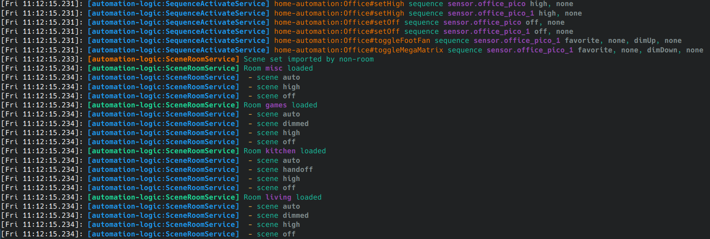

# AutoLogService

## Basics

Boilerplate provides a wrapper around [pino](https://www.npmjs.com/package/pino) for logging.
It can output json logs with no processing for production environment, or pass them through an internal pretty formatter to make it more readable for humans.

The wrapper will automatically pick up on the class name + library name of the provider it has been injected into.
This information will be added as a context property to every log message.

### API

Usage example

```typescript
import { AutoLogService } from "@steggy/boilerplate";
import { Injectable } from "@nestjs/common";

@Injectable()
export class MyProvider {
  constructor(private readonly logger: AutoLogService){}

  public doTheThing() {
    this.logger.debug(`Did the thing`);
    this.logger.info({ now: Date.now() },`With some extra info`);
  }
}
```

### Context

The log context provides a reference to the library and class name of whatever generated the log.
This information can be automically determined without additional work by the developer in most circumstances.
In the case of logs originating from an application provider, instead of a library provider, the `library:` prefix is omitted from the context and only the class name is given.

**Caveat**: Transient providers require an additional annotation in order for contexts to be properly attached.

```typescript
import { AutoLogService } from "@steggy/boilerplate";
import { Injectable, Scope } from "@nestjs/common";

@Injectable({ scope: Scope.Transient })
export class MyProvider {
  constructor(
    @InjectLogger() private readonly logger: AutoLogService
  ){}
}
```

## Pretty Logger



### Context colors

| Log Level | Color |
| --- | --- |
| **trace** | `grey` |
| **debug** | `blue.dim` |
| **warn** | `yellow.dim` |
| **error** | `red` |
| **info** | `green` |
| **fatal** | `magenta` |

## Message Formatters

Message color is cyan by default, but some formatters can be used to provide extra coloring for readability.
The formatters are intended to be simple to implement, and not significantly detract from readability when logs are in json form.

Below is a listing of substitutions performed, and recommendations of how they should be used.

### Item references

| | |
| -- | --- |
| Format | `[TEXT]`  |
| Effect | `magenta.bold` |

Typically used for noun references. There should be a max of one per log message. Ex: "[name] did a thing!"

### Extra info

| | |
| -- | --- |
| Format | `{TEXT}`  |
| Effect | `gray.bold` |

Extra variables that can be easily expressed as small strings.
More than one per log is acceptable, but only with a separator.

### Lists

| | |
| -- | --- |
| Format | `" - "` (dash w/ spaces at start of log)  |
| Effect | yellowBright dash |

Ideally should have a message prior to the list to add context.

### Object reference

| | |
| -- | --- |
| Format | `path#property` |
| Effect | `yellow` |

Internally used for code references in log messages: `log-context#methodName`
