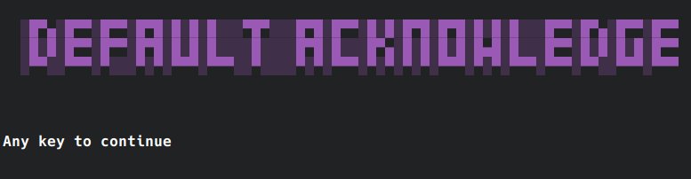
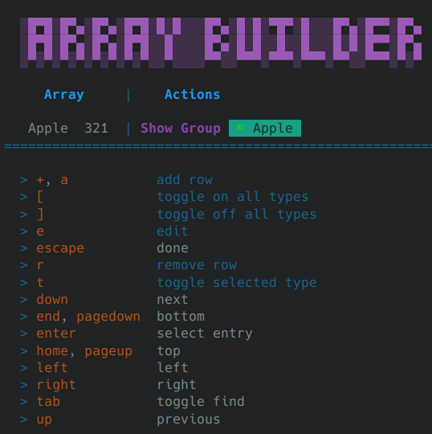
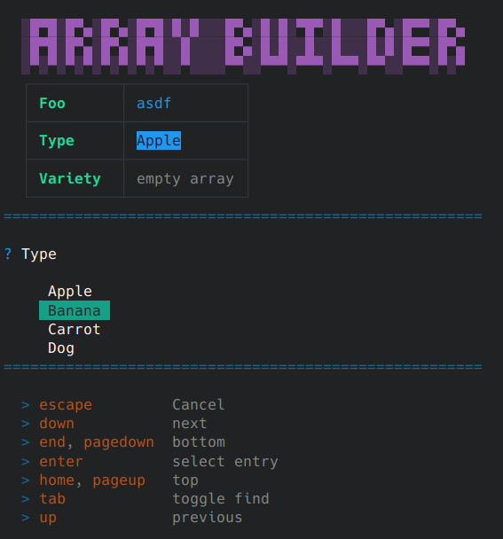
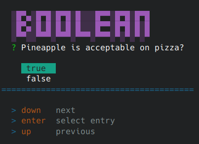
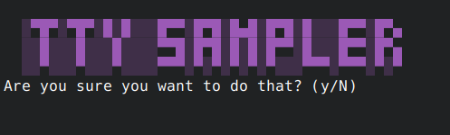
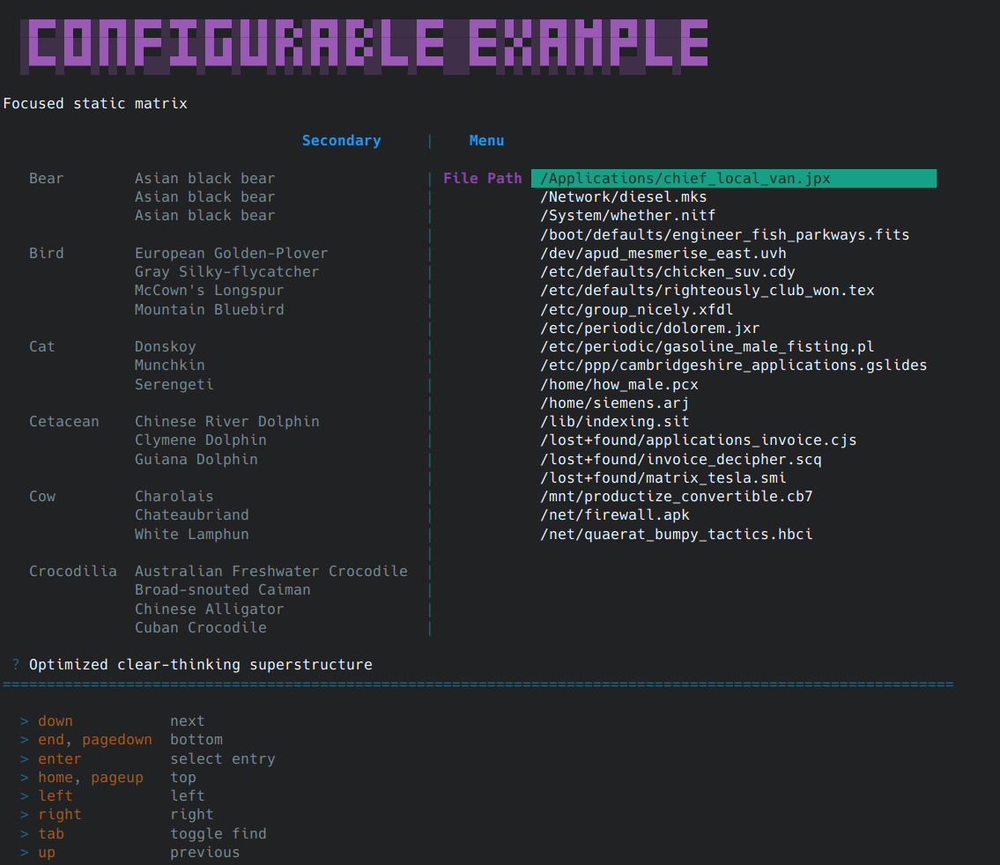
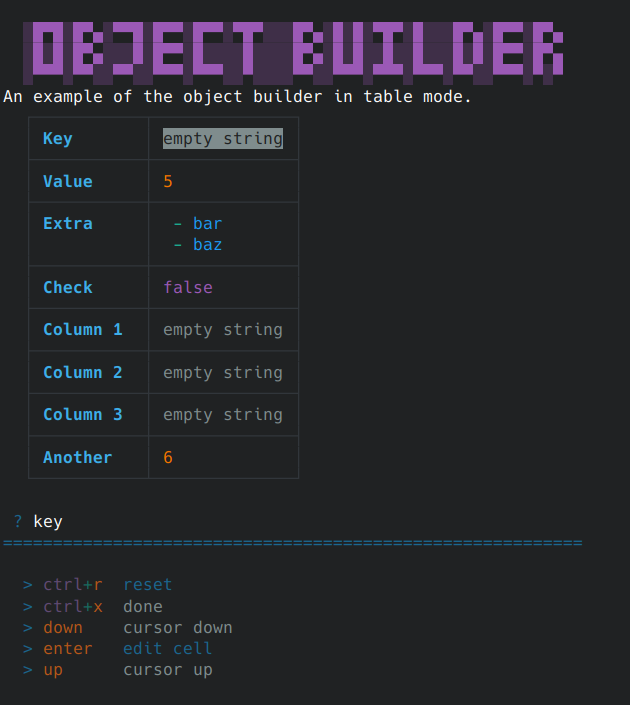
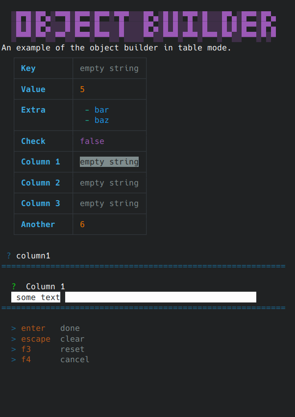
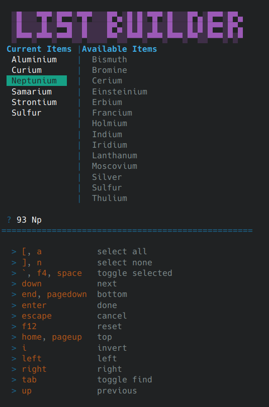
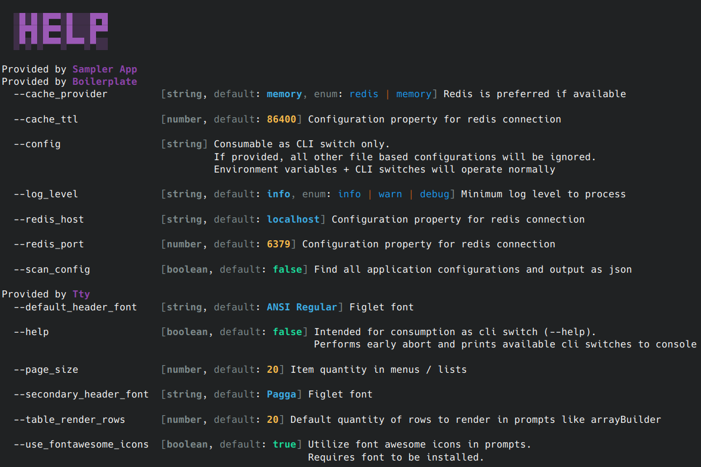

# @steggy/tty

## Description

This library provides human / terminal interactions.

## Exported Services

High level overview

### `SyncLoggerService`

Same as `AutoLogService`, but will output directly to the console.
AutoLog utilizes `pino` + an internal formatter, which will not always print to screen as quickly as expected, causing rendering race conditions.
`SyncLogger` will help to enforce order of operations

### `ApplicationManagerService`

Work with the application header.
Set/resetting the header will clear the current screen content.

### `PromptService`

Methods for launching editors and menus to retrieve information from the user.

### `IconService`

Icon translations for font awesome

### `ScreenService`

Work with the cursor, print text, and buffered screen rendering.

### `TextRenderingService`

Tools for formatting text

## Editors

### **Acknowledge**

Pause, and wait for user interaction



### **Array Builder**

Construct an array of objects that conform to a common definition.

| Image | Description |
| --- | --- |
|  | Base view with 1 option |
|  | Actively editing a property of an object |

### **Boolean**

Request a true / false value from the user



### **Confirm**

Present a message to the user, and ask for yes / no confirmation



### **Date** / **Time** / **Date Range**

Build a date/time from user input. Can accept date in fuzzy formats, and granular

| Image | Description |
| --- | --- |
|  | Fuzzy input method |
|  | Granular input method |

### **Menu**

Highly configurable menu, with easy to configure keyboard interactions, and tons of features.



### **Object Builder**

Construct a single flat object

| Image | Description |
| --- | --- |
|  | Base view |
|  | With editor |

### **Pick Many**

Select options out of a list.



### **String**

Request text from the user


## Configuration options

The following configuration options are utilized by this library.

```ini
; default configuration
[libs.tty]
  DEFAULT_HEADER_FONT=ANSI Regular
  SECONDARY_HEADER_FONT=Pagga
  PAGE_SIZE=20
  TABLE_RENDER_ROWS=20
  USE_FONTAWESOME_ICONS=true
  DEFAULT_PROMPT_WIDTH=50
```

### `DEFAULT_HEADER_FONT`

```typescript
application.setHeader(PRIMARY, SECONDARY);
```

The figlet font to use with `setHeader` commands.
This font will be used with the `PRIMARY` header in the above example.

### `SECONDARY_HEADER_FONT`

```typescript
application.setHeader(SECONDARY);
application.setHeader(PRIMARY, SECONDARY);
```

The figlet font to use with `setHeader` commands.
This font will be used with the `SECONDARY` header in the above examples.

### `PAGE_SIZE`

Render item count for menus and lists.

### `TABLE_RENDER_ROWS`

Render row count for tables

### `USE_FONTAWESOME_ICONS`

Utilize font awesome icons in prompts. Requires fontawesome to be installed on system

### `DEFAULT_PROMPT_WIDTH`

The default character width to render string prompt type backgrounds

## Switches

Flags and switches that are intended to be used on the command line when launching the app.

### `HELP`

```bash
# Usage example
node ./dist/apps/sampler-app/main.js --help
```



Scan the application for configuration options, and output a summary of items that can be configured via command line switches
